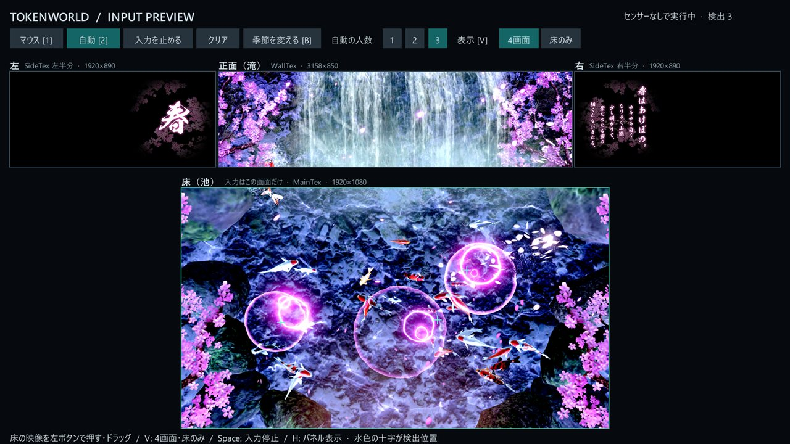

# TokenWorld

Unity **2022.3.62f2** のプロジェクト（2019.3.15f1から移行）。Unity Hub には、このリポジトリ内の `TokenWorld/` を追加する。

## バージョンとブランチ

| ブランチ | Unity | 用途 |
| --- | --- | --- |
| [`main`](https://github.com/mizuamasi/touken_world/tree/main) | **2022.3.62f2** | 現行版。制作・I/O接続の整備はこちらで継続する |
| [`archive/unity2019.3.15f1`](https://github.com/mizuamasi/touken_world/tree/archive/unity2019.3.15f1) | **2019.3.15f1** | 移行前の保存版。基準コミット `d05a0d2` の内容を保持する |

両方ともUnityプロジェクトは `TokenWorld/` にある。通常は `main` を使う。旧版を確認するときは別フォルダへ取得し、対応するUnityで開く。

```sh
git clone --branch archive/unity2019.3.15f1 --single-branch https://github.com/mizuamasi/touken_world.git touken-world-unity2019
```

旧版の修正が必要な場合は保存ブランチから別の作業ブランチを作り、`archive/unity2019.3.15f1` 自体は移行前の状態で残す。

## プロジェクト

Build Settings の先頭は制作用の `Assets/Workspace/Scenes/Workspace.unity`。
初回起動時にはパッケージの解決とアセットのインポートが行われる。

## 使い方（制作シーン）

作品は制作シーン `Assets/Workspace/Scenes/Workspace.unity` で作る。URGセンサーや外部設定ファイルは不要。展示は床を含む4画面で、制作シーンではそれを見ながら作業できる。

1. Unity Hub で `TokenWorld/` を開き、メニューの **TokenWorld > Open development scene** を選ぶ。
2. **Game ビュー**を見る。上段に左・正面（滝）・右、下段に床（池）が並ぶ。部屋の中から見た並びで、床の上端が正面の壁の側。Play 前から表示される。
3. **Scene ビュー**では、床と正面のカメラに映る範囲が色付きの枠と名前で表示され、隅の **4画面プレビュー** に各画面の今の映像が出る。物を置いたり動かしたりすると、どの画面にどう映るかをその場で確認できる。
4. **Play** を押し、床の映像をマウスで押す・ドラッグする。人が床に立った位置として作品が反応する。正面や左右での反応もそのまま見られる。
5. 作品をつなぐ。検出位置は `Workspace` の **InteractionInput** から届く。`Workspace > Content` の **PrefabOutput** に Prefab を入れると、押した位置にそれが出る。独自のスクリプトのつなぎ方は [I/O接続リファレンス](CONTENT_WORKFLOW.md) を参照。



| やりたいこと | 操作 |
| --- | --- |
| マウス入力 / 自動入力（1〜3点）に切り替える | Play 中に `1` / `2` |
| 入力を止める・再開する | Play 中に `Space` |
| 季節を変える | Play 中に `B` |
| 4画面 / 床のみの表示を切り替える | Play 中に `V`。Play 前は `Workspace` の **InputPreview > Show All Screens** |
| 操作パネルを隠す・出す | Play 中に `H` |
| Scene ビューの枠を消す・出す | Scene ビュー上部のツールバーにある Gizmos の切り替えボタン（マウスを乗せると「Toggle visibility of all Gizmos in the Scene view」と出る） |
| 4画面プレビューを隠す・出す | Scene ビューのタブを右クリックして **Overlay Menu** を開き、**4画面プレビュー** を切り替える |

Game ビューが小さいと各画面も小さくなる。Game ビューのタブを最大化（`Shift+Space`）するか、Play 中に `H` でパネルを隠す。
キー操作は Game ビューを選んだ状態で行う。入力は床の画面だけで、正面・左右は表示のみ。

制作シーンは外部画像の読み込み、季節の自動切り替え、Spout出力を初期状態では無効にしている。

## 展示用シーン

既存の `Assets/Scenes/Main.unity` は展示用として残している。こちらをビルドするときは Build Settings の対象を切り替える。
Spoutは同梱プラグインの仕様によりDirect3D 11を使う。URGセンサーが接続されていない場合は警告を出して映像の再生を続ける。
センサーとの通信・反応は実機での確認が必要。

外部設定・画像は既存の `C:\_token\` 以下を参照する。テロップ画像用フォルダ `C:\_token\_telop` がない、またはPNGが空の場合は画像テロップを表示しない。
センサー設定や外部画像を使う場合は、各PCに必要なファイルを用意する。

Unity 2022への移行では、既存のBuilt-in Render Pipelineを継続し、URPへの変換は行っていない。

## Gitで管理するもの

- `TokenWorld/Assets/`：スクリプト、シーン、素材、プラグインと、それぞれの `.meta`
- `TokenWorld/Packages/`：`manifest.json` と `packages-lock.json`
- `TokenWorld/ProjectSettings/`：共有するプロジェクト設定

アセットの追加・移動・削除は、対応する `.meta` と一緒にコミットする。
Unityの設定は **Visible Meta Files** と **Force Text** を使用する。
既存のバイナリ形式のアセットはそのまま保持している。

## 除外と差分の設定

ルートの `.gitignore` はOS・IDEの一時ファイルを、`TokenWorld/.gitignore` はUnityのキャッシュ、ログ、ローカル設定、ビルド出力を除外する。
ビルド先は `TokenWorld/Builds/` にすると、実行ファイルと付随データをまとめて管理対象外にできる。
除外されたファイルはローカルに残り、Gitには追加されない。

`.gitattributes` はテキストを自動判定し、画像・音声・ネイティブプラグインなどをバイナリとして扱う。
`.asset` と `.prefab` はテキストとバイナリが混在するため、拡張子だけでテキスト扱いを強制しない。
既存ファイルの改行は一括変換していない。

参考：[Unityの外部バージョン管理](https://docs.unity3d.com/2019.3/Documentation/Manual/ExternalVersionControlSystemSupport.html)、[Gitの属性設定](https://git-scm.com/docs/gitattributes)。
